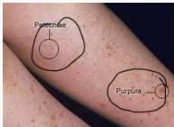
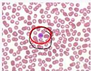

2

# IMMUNE THROMBOCYTOPENIC PURPURA (ITP)

## KLINIS

- Gejala utama **perdarahan kulit dan mukosa**: perdarahan gusi, epistaksis, perdarahan GI, perdarahan intrakranial, menoragia, hematuria
- Tidak ada gejala konstitusional (penurunan BB, keringat malam, nyeri tulang)
- Jarang ditemukan hepatospenomegali, limfadenopati, tidak ditemukan jaundice atau stigmata kelainan kongenital

## PENUNJANG

- Darah lengkap: **Trombositopenia tanpa anemia**
- MDT: **Megatrombosit**
- Profil koagulasi: BT &gt;&gt;&gt; Trombosi ↑kp
- Aspirasi sumsum tulang → tidak rutin dilakukan, kecuali pada usia &gt;60 tahun, gambaran klinis tidak khas, pasien tidak respon terhadap terapi

Di soal UKMPPD, cari adanya riwayat infeksi yang sudah sembuh dan diikuti oleh adanya trombositopenia akibat autoimun

Kelon Complete Batch Nov 2025

MEDIKO.ID

(Daniel, 2024) Hal. 211

(PAPDI, 2019) Hal. 498