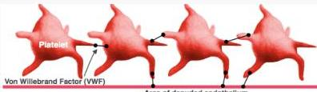

VON WILLEBRAND DISEASE (vWD)

Protein vW

# DEFINISI

- Gangguan pembekuan darah yang ditandai perdarahan mukokutan massif
- Sebagian besar herediter (autosomal dominant), namun bisa secara sekunder akibat penyakit lain

Von Willebrand Factor (VWF)

Area of denuded endothelium

# Von Willebrand Factor (VWF)

- Glikoprotein yang diproduksi sel endotel dan megakariosit
- Berperan penting pada hemostasis:
- Adhesi platelet dan komponen subendotel
- Karier FVII agar tidak terdegradasi
- Berkontribusi dalam clotting fibrin

# KLINIS

- Mudah memar (mild bleeding), ptekiae
- Perdarahan mucosa (orofaring, GI, uterine)
- Menorrhagia
- Prolonged and excessive bleeding after trauma

# PENUNJANG

- Platelet normal atau rendah, BT ↑, PT/INR normal, aPT↑ normal (memanjang jika faktor VIII sangat rendah)
- Test vWF antigen → vWF rendah
- Test ristocetin menggunakan antibiotika, apabila waktu aglutinasi meningkat → vWD

# TATALAKSANA

- Cryoprecipitate VWF - FVIII
- Desmopressin memicu sekresi VWF ↑

Kelon Complete Batch Nov 2025

MEDIKO.ID

(Sabih, 2023) Hal. 2