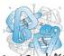
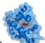

ANEMIA DEFISIENSI BESI

= 0 (16) gagal = 0 Fe drdr.

ETOLOGI

15us

sitat aram

A

BENTUK FE

# FISIOLOGIS

Peningkatan kebutuhan

Pematuritas, pertumbuhan anak/remaja, kehamilan (TM 2-3), laktasi, menstruasi, terapi eritropoietin

LINGKUNGAN

Menurunan asupan

Malnutrisi, diet (vegetarian, vegan, kurang zat besi)

PATOLOGIS

Penurunan absorbsi

Gastrektomi, infeksi H. pylori, IBD, gastritis atron

Perdarahan Kronik

Genitourinari → menorrhagia, keganasan

Gastrointestinal → ulkus peptikum, gastritis erosive, varises esophagus, keganasan, hemorrhoid, infeksi hookworm

Renal → batu ginjal, infeksi saluran kemih

Obat

Glukokortikoid, salisilat, NSAID, PPI

# 1. HEME

Berikatan dengan :

Hemoglobin

Myoglobin

Number : Produk hewani

Dalam bentuk ferrous (Fe2+)

# 2. NON HEME

Free ion molecules

Number : Produk nabati

Dalam bentuk ferric (Fe3+)

Kelon Complete Batch Nov 2025

MEDIKO.ID

(Kumar, 2022) Hal. 4

4A