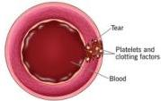
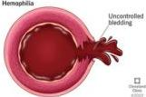
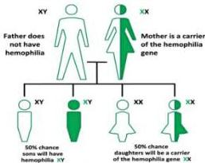

HEMOFILIA

# Definisi

- Jenis hemofilia berdasarkan defisiensi:
- Hemofilia A: factor VIII (classic hemophilia) → 85-90% kasus
- Hemofilia B: factor IX (Christmas disease)
- Hemofilia C: faktor XI (Rosenthal syndrome) → 2000-2015
- Hemofilia A dan B diturunkan secara X-Linked recessive, sedangkan hemofilia C diturunkan secara autosomal recessive (kromosom 4)

Normal blood vessel

|  Derajat | Aktivitas FVIII/IX | Perdarahan  |
| --- | --- | --- |
|  Berat | <1% (<1 U/dL) | Hemartrosis spontan terjadi 1-2 kali seminggu  |
|  Sedang | <1-5% (1-5 U/dL) | Hemartrosis atau perdarahan akibat trauma ringan/spontan lebih jarang terjadi (1x/bulan)  |
|  Ringan | >5-40% (5-40 U/dL) | Akibat trauma lebih berat/pasca tindakan medik sangat jarang hemartrosis spontan  |

Key
Does not have Hemophilia
Carrier of the Hemophilia gene
Has Hemophilia

Kelon Complete Batch Nov 2025

MEDIKO.ID
A DIVISION OF MEDIKO BANK

(PNPK, 2021) Hal. 17,20
(Menezes, 201) Hal. 277