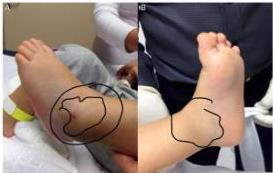

2

HEMOFILIA

#

# KLINIS

- Perdarahan pada pria: spontan, pasca trauma, pasca tindakan medis
- Mudah memar tanpa sebab jelas sejak bayi
- Bengkak dan nyeri sendi → Hemartrosis
- Hematoma, perdarahan otot/jar. lunak/mukosa
- Perdarahan intrakranial: sal. cerna, sal. napas → syok, sesak, kesadaran menurun

Hemarthrosis spontan

# DIAGNOSIS

- Pemeriksaan lab (screening): jumlah trombosit normal, BT dan PT normal, CT dan APTT memanjang
- Pemeriksaan aktivitas FVIII dan FIX (factor assay) → gold standard dan untuk mengetahui derajat hemofilia
- Pemeriksaan radiologis sesuai indikasi klinis/komplikasi
- USG → sinovitis, kerusakan kartilago sendi, perdarahan sendi/otot, perdarahan intraabdomen
- CT scan → perdarahan intracranial
- MRI → artropati hemofilik perdarahan dalam otot/tulang (pseudotumor), evaluasi preoperatif

Kelon Complete Batch Nov 2025

MEDIKO.ID

(PNPK, 2021) Hal. 18-20 (Menezes, 2014) Hal. 278