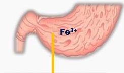
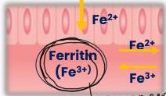
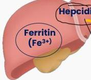
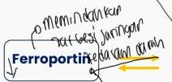
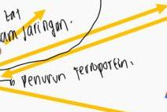
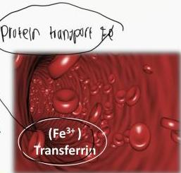
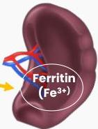

4A

# PATOFISIOLOGI

Dipecah di lambung

Fe²⁺

Fe²⁺

Fe³⁺

Fe²⁺

Fe³⁺

Fe²⁺

- penyimpan

- bet

- kwas

- paragon.

Hepcidin

Ferritin (Fe³⁺)

Piotelin transport

Kelon Complete Batch Nov 2025

MEDIKO.ID

(Kumar, 2022) Hal. 1-2

4A