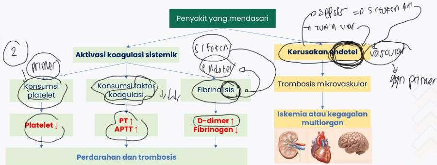

DISSEMINATED INTRAVASCULAR COAGULATION

cum puron

PT ↑ APTT CT

BT

# DEFINISI

Kondisi serius akibat aktivasi koagulasi yang meningkat, persisten, dan generalisata serta biasanya menyebabkan pembentukan mikrotrombus pada mikrovaskular

Kelon Complete Batch Nov 2025

MEDIKO.ID

(Polimeni, 2021) Hal. 2 (Yang, 2025) Hal. 2