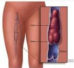
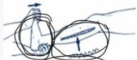

DEEP VEIN TROMBOSIS (DVT)

zumiyakir Vena profunda taki

# DEFINISI

- Obstruksi vena dengan gangguan mekanisme refluks akibat pembentukan thrombus
- Tersering di sistem vena ekstremitas bawah
- Berisiko menyebabkan emboli paru

# ETIOLOGI

- Triad Virchow.
- Stasis aliran darah
- Hiperkoagulasi → PVH
- Gangguan endotek yang menyebabkan prokoagulan → operasi befi

# FAKTOR RISIKO TROMBOSIS

- Imobilisasi (bed rest, GA, perjalanan)
- Kompresi (kehamilan, tumor, stenosis)
- Gangguan mekanik vena trauma, kateter iv
- Peningkatan viskositas, polisitemia, dehidrasi

# KLINIS DAN PENUNJANG

- Inflamasi: edema unilateral, nyeri, eritema
- Pembuluh superficial teraba, distensi vena
- Homans sign (+) → nyeri dorsofleksi
- D-Dimer &gt;&gt;&gt; FDP meningkat
- USG doppler venografi (gold standard) tetapi jarang dilakukan dan invasif

# TATALAKSANA

Antikoagulan (heparin, warfarin, rivaroxaban)

Trombus di vena kaki

Homan's Sign

Kelon Complete Batch Nov 2025

(PAPDI, 2019) Hal. 544-549