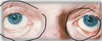
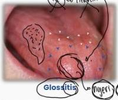
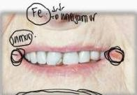
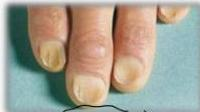

ANEMIA DEFISIENSI BESI

Issis 205 genome

# ANAMNESIS

Penurunan penghantaran oksigen ke jaringan
- Gejala umum: lemah, mudah lelah, nyeri kepala, sesak napas, mata berkunang-kunang, lightheadedness, rambut rontok

# PEMERIKSAAN FISIK

- Tampak lemah dan anemis, takikardia, glossitis, stomatitis, angular cheilosis, koilonychia, pica, disfagia
- Tidak ada splenomegali

Anak-anak: penurunan kognitif, gangguan perkembangan mental dan motorik
Ibu hamil: risiko premature, BBLR, mortalitas

Konjungtiva anemis

Palmar anemis

Koilonychia

Pica disorder

Kelon Complete Batch Nov 2025

MEDIKO.ID

(PAPDI, 2014) Hal. 2593

4A