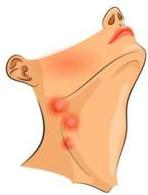
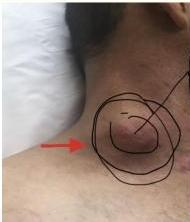
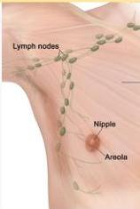
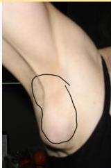
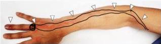

LIMFADENITIS vs LIMFADENOPATI

## Limfadenitis
Peradangan pada **kelenjar getah bening**

Regio colli

## Limfadenopati
Pembengkakan **kelenjar tanpa proses peradangan**

Regio axillaris

## Limfangitis
Peradangan pada **saluran kelenjar getah bening**

Kelon Complete Batch Nov 2025

MEDIKO.ID

3A

4A