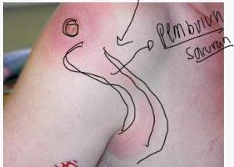

#

# Soal 22

Seorang pria 27 tahun datang ke puskesmas dengan keluhan muncul benjolan di ketiak. Benjolan dirasa nyeri dan panas sejak 3 hari yang lalu. Pasien mengatakan sebelumnya daerah benjolan sempat tertusuk kayu saat bekerja. Pada pemeriksaan tanda vital didapatkan dalam batas normal. Pada pemeriksaan fisik status lokalis didapatkan gambaran berikut.

Diagnosis yang tepat pada pasien adalah?

A. Limfangitis
B. Limfadenopati
C. Limfoma Hodgkin
D. Limfoma non Hodgkin
E. Limfadenitis TB

Kelon Complete Batch Nov 2025

MEDIKO.ID

ASSOCIATION OF MEDICAL CENTERS