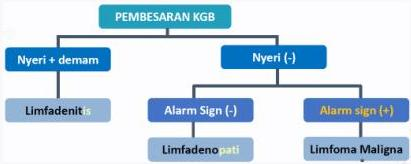

#

# RASIONALE

Keluhan muncul benjolan di ketiak, nyeri dan panas, sebelumnya daerah benjolan sempat tertusuk kayu saat bekerja + pemeriksaan fisik status lokalis didapatkan gambaran *Eritem mengikuti jalur Limfatik → Dx. LIMFANGITIS + Limfadenitis (KGB membesar + Nyeri)*

## A. Limfangitis

B. Limfadenopati (nodus limfe tanpa tanda peradangan)
C. Limfoma Hodgkin (tidak nyeri, gejala konstitusional (+))
D. Limfoma non Hodgkin (tidak nyeri, gejala konstitusional (+))
E. Limfadenitis TB (abses, fistel, nekrosis kaseosa)

Limfangitis
Peradangan pada saluran kelenjar getah bening

Kelon Complete Batch Nov 2025

MEDIKO.ID

A