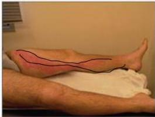

中

# Soal 23

Bukiters → Givkasa 4A.

Seorang Pria, 50 tahun datang dengan nyeri pada kaki kiri sejak 3 hari yang lalu. Pasien bercerita jika sebelumnya menginjak batu dan mulai merasa sakit. Riwayat minum obat gula rutin sejak 10 tahun yang lalu. Pada tungkai didapatkan gambaran sebagai berikut.

## Apakah mekanisme yang terjadi pada keluhan pasien ini?

A. Inflamasi saluran limfe akibat fokus infeksi
B. Reaksi inflamasi akibat penyakit autoimun
C. Pembengkakan nodus limfatikus
D. Hipersensitivitas tipe cepat
E. Infeksi pada kulit dan jaringan lunak di bawahnya

Kelon Complete Batch Nov 2025

MEDIKO.ID

ASSOCIATE MEDICINOLOGY