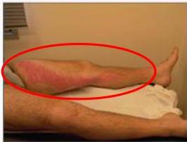

#

# RASIONALE

Keluhan nyeri pada kaki kiri yang sebelumnya menginjak batu dan mulai merasa sakit + Riw DM (faktor risiko) + Pada tungkai didapatkan gambaran *Eritema sepanjang jalur Saluran Limfe*

## A. Inflamasi saluran limfe akibat fokus infeksi

B. Reaksi inflamasi akibat penyakit autoimun (bukan suatu autoimun)
C. Pembengkakan nodus limfatikus (pada limfadenopati, KGB tidak membesar)
D. Hipersensitivitas tipe cepat (tidak tepat)
E. Infeksi pada kulit dan jaringan lunak di bawahnya (kemerahan difus, dapat disertai edema)

Kelon Complete Batch Nov 2025

MEDIKO.ID

ASSOCIATION OF MEDICINE