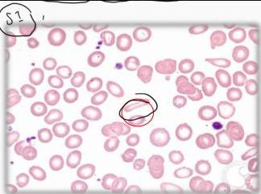

ANEMIA DEFISIENSI BESI

Teoriiin J.J.

# Tahapan Anemia Defisiensi Besi

|   | Normal | Negatif iron balance | Poor erythropoiesis | Iron deficiency anemia  |
| --- | --- | --- | --- | --- |
|  Iron stores |  |  |  |   |
|  Circulating iron |  |  |  |   |
|  Stored in bone marrow | 1-3+ | 0-1+ | 0 | 0  |
|  Serum ferritin (mcg/dl) | 50-200 | <20 | <15 | <15  |
|  TIBC (mcg/dl) | 300-360 | >360 | >380 | >400  |
|  Serum iron (g/dl) | 50-150 | NL | <50 | <30  |
|  Saturation (%) | 30-50 | NL | <50 | <30  |
|  Protoporphyrin (mcg/dl) | 30-50 | NL | >100 | >200  |
|  Morphology | NL | NL | NL | Microcytic/hypoc hromic  |

# Penunjang

Morfologi: mikrositik hipokrom

Sediaan darah tepi: anisositosis, poikilositosis, pencil cell

Lab: Serum Fe, TIBC, Ferritin ↓

Anisositosis, poikilositosis, pencil cell

Kelon Complete Batch Nov 2025

MEDIKO.ID

(PAPDI, 2014) Hal. 2595

4A