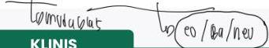
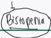
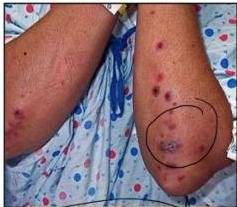
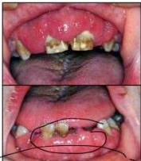
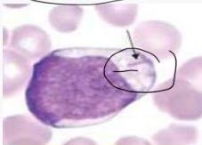
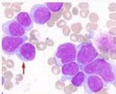

2

# ACUTE MYELOBLASTIC LEUKEMIA

## KLINIS

- Gejala anemia dan perdarahan kulit/mukosa
- Anoreksia, penurunan BB, hipertrofi gingiva
- Leukostasis: sesak napas, nyeri dada, priapismus
- Lesi infiltratif **abu-abu pada kulit (leukemia cutis)**
- Nyeri kepala dan manifestasi neurologis lain (akibat perdarahan/leukemia meningitis)
- Splenomegali tidak dominan

## PENUNJANG

- **Apusan darah tepi**: ditemukan **sel blast**, **auer rod**
- **DL anemia, trombositopenia**
- **Aspirat sumsum tulang**:
- **Sel blas &gt; 20% total sel**
- **Myeloperoxidase (+)**

Leukemia Cutis

Hiperplasia Gingiva

Auer Rod

Sel Blast

Kelon Complete Batch Nov 2025

MEDIKO.ID

(PAPDI, 2019) Hal. 511-512