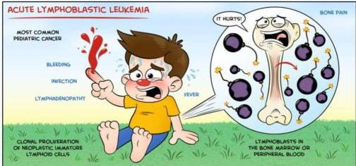
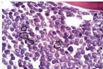

2

# ACUTE LYMPHOBLASTIC LEUKEMIA

## KLINIS

- Anak-anak dan dewasa muda (awal 20 tahun) dengan nyeri tulang
- Gejala anemia dan perdarahan
- Tanda infeksi
- Hepatosplenomegali
- Limfadenopati yang tidak responsif terhadap antibiotik

## PENUNJANG

- DL: Leukositosis
- Apusan darah tepi: ditemukan sel limfoblas tanpa auer rod
- Aspirasi sumsum tulang
- Hiperselular, sel limfoblas &gt;&gt; dengan hitung jenis blas/progranulosit &gt;30%
- Myeloperoxidase (-)

WWW.MEDCOMIC.COM
© 2015 JORGE MUNIZ

## MEDIKOLOGIC

Anak Linu Linu Nyeri Tulang (ALL) = nyeri tulang

Aspirat sumsum tulang
Sel normal digantikan sel limfoblast

Kelon Complete Batch Nov 2025

MEDIKO.ID
www.medcomic.com

(PAPDI, 2019) Hal. 513-514