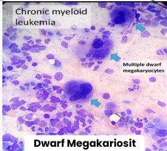
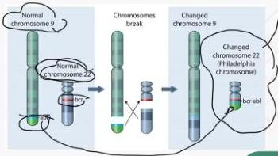

CHRONIC MYELOID LEUKEMIA

# KLINIS

- Mudah lelah, malaise, anemis
- Penurunan berat badan, demam, nyeri perut LUQ
- Splenomegali dan hepatomegali masif
- Gout arthritis
- Perdarahan jarang
- Leukositosis berat: infark miokard, vasoocclusive disease, thrombosis vena, gangguan penglihatan

# PENUNJANG

- DL: Leukositosis didominasi PMN, tidak trombositopenia
- Apusan darah tepi: basofilia absolut, eosinofilia absolut, gambaran semua tahap maturasi sel, sel blas &lt;2%
- Aspirasi sumsum tulang: hiperselular dengan hyperplasia myeloid, retisulin atau fibrosis kolagen, dwarf megakariosit
- Genetik: Kromosom Philadelphia (fusi gen BCF, ABL) akibat translokasi kromosom 9:22

Kelon Complete Batch Nov 2025

MEDIKO.ID

(PAPDI, 2019) Hal. 512-513