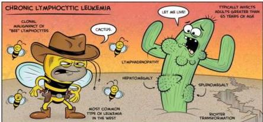
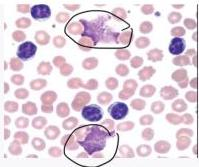

CHRONIC LYMPHOCYTIC LEUKEMIA

# KLINIS

- 90% asimptomatiki lansia &gt;&gt;
- 10 % mengalami gejala konstitusional: penurunan BB, demam &gt; 2 minggu tanpa bukti infeksi, keringat malam, mudah lelah, penurunan nafsu makan
- Limfadenopati lokal atau generalisata
- Hepatosplenomegali

# PENUNJANG

- DL: limfositosis (&gt; 5000 sel/mm3 atau &gt;95%), anemia, neutropenia, trombositopenia
- Apusan darah tepi: limfositosis, smudge cell/basket cell (limfosit yang rusak saat pembuatan apusan)
- Aspirasi sumsum tulang: tidak diperlukan pada CLL, normal/hiperselular, infiltrasi limfosit &gt;30%

NORMANPACOMIC.COM
© 2015 JORGA AURIC

# MEDIKOLOGIC

Cerita LaLuku Semudge = CLL Smudge Cells

Apusan Darah Tepi
Proliferasi limfosit dengan smudge cells

Kelon Complete Batch Nov 2025

MEDIKO.ID

(PAPDI, 2019) Hal. 515-516