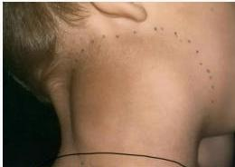
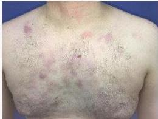

LIMFOMA

# DEFINISI

Lem Fare

Keganasan sel pada jaringan limfoid

# KLINIS

- B-symptoms: BB turun &gt;10% dalam 6 bulan, low-grade fever &gt;1 minggu tanpa sebab, keringat malam
- Gejala anemia
- Penyakit infeksi (toksoplasma, tuberkulosis)
- Limfadenopati yang cepat berkembang dan tidak nyeri
- Hepatomegali
- Masa abdomen (pada Burkitt lymphoma)
- Lesi kulit

# PENUNJANG

- Gold standard biopsy
- Hodgkin, ~~Reed Stenberg~~ /ow1 e40 000
- Non-Hodgkin, Starry sky

Limfadenopati

Lesi kulit limfoma

Kelon Complete Batch Nov 2025

MEDIKO.ID

(PAPDI, 2019) Hal. 517-522