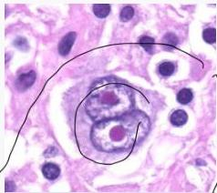
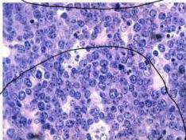

LIMFOMA

LDH

Reed-Sternberg/owl eye

"Starry Sky" Burkitt Lymphoma

|  Hodgkin | Non-hodgkin  |
| --- | --- |
|  Keterlibatan nodus limfa soliter dan terlokalisir, menyebar contiguous
(menyebar ke nodus atau jaringan ekstranodus sekitar) | Alwomen
Keterlibatan nodus limfatik yang multiple, menyebar non-contiguous  |
|  Sel read-sternberg positif | Sebagian besar sel B, beberapa turunan dari sel T, *NK*  |
|  Distribusi bimodal (pada dewasa muda dan >55 tahun) | Dapat terjadi pada anak-anak dan dewasa  |
|  Berhubungan dengan EBV
HHL-4 | Berhubungan dengan penyakit autoimun dan infeksi virus (EBV, HIV, HTLV)
V. H. M. T. R. O. i  |

MEDIKOLOGIC

Mata Burung Hantu Merah = Reed - Owl Eye Melihat Starry Sky di Bukit

Kelon Complete Batch Nov 2025

MEDIKO.ID

(PAPDI, 2019) Hal. 517-522