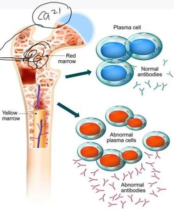

1

MULTIPLE MYELOMA

# DEFINISI

- Keganasan **sel plasma** yang menyebabkan penumpukan protein monoclonal (terutama IgA &amp; IgG)
- Manifestasi berkaitan dengan infiltrasi sel sumsum tulang atau deposisi immunoglobulin organ

# KLINIS

- **Old** : Usia &gt; 65 tahun
- **Calcium** : meningkat &lt; 11 mg/dL (&gt;2,75 mmol/L)
- **Renal Failure** : GFR &lt; 40 ml/min atau Cr &gt; 2 mg/dL
- **Anemia** : Hb &lt; 13 (laki-laki) atau &lt; 12 (perempuan)
- **Bone lytic lesion** : lesi ≥ 5 mm

# GEJALA

Anemia nyeri tulang, oliguria, penurunan berat badan

Kelon Complete Batch Nov 2025

MEDIKO.ID

(AIH, 2024) Hal. 1802