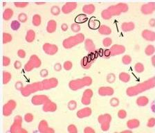
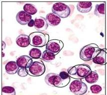
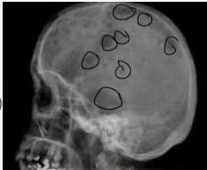
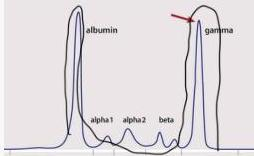

MULTIPLE MYELOMA

↑ 1g

gamma ↑

# PENUNJANG

- Darah tepi
- Urinalisis
- Elektroforesis protein serum
- Aspirasi sumsum tulang (GS)
- Radiografi

- gambaran Rouleaux
- protein Bence Jones
- Spike protein M

: proliferasi sel plasma klonal (fried egg appearance)
: lesi litik tulang (punched out lesion)

# MEDIKOLOGIC

OLD - Old Age
C - Calcium Elevated
R - Renal Failure
A - Anemia
B - Bone Lytic Lesions

Gambaran Rouleaux

Fried egg appearance

Lesi litik tulang

M spike

Kelon Complete Batch Nov 2025

MEDIKO.ID

A LATE LIFE GROUP

(AJH, 2024) Hal. 1802