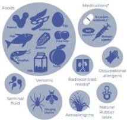
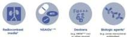
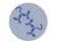

REAKSI ANAFILAKSIS
Tipe

# DEFINISI

- Reaksi hipersensitivitas sistemik yang mengancam jiwa
- Ditandai dengan onset yang cepat dan kegawatan pada airway, breathing, circulation, disertai perubahan kulit dan mukosa
- Bentuk klinis terberat dari alergi sistemik akut

# PATOGENESIS

- Ig-E dependent: interaksi alergen dengan sel mast dan basofil → mekanisme paling umum
- Non Ig-E dependent
- Imunologik → aktivasi sistem-komplemen, aktivasi sistem koagulasi, Ig-G dependent
- Non-imunologik → olahraga, alcohol
- Idiopatik (tidak ada trigger)

# FAKTOR RISIKO

- Endogen: usia (bayi, remaja, lansia), wanita (persalinan, melahirkan, pre-menstrual), penyakit kardiovaskular, penyakit atopik-infeksi
- Eksogen: obati (β-blocker, ACE-I, NSAID), alkohol, aktivitas fisik, stress-emosional

Immunologic Mechanisms (IgE Dependent)

Immunologic Mechanisms (IgE independent)

Nonimmunologic Mechanisms (Direct mast cell activation)

Idiopathic Anaphylaxis (No apparent trigger)

Previously unrecognized allergen

Mastoryosis / clonal mast cell disorder

Kelon Complete Batch Nov 2025
MEDIKO.ID
[WAO, 2020] Hal. 3-11
4A