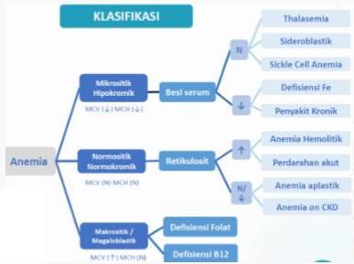

#

RATIONALE

Wanita primigravida dengan keluhan kahs Anemia + glossitis (+) dan koilonikia (+), Hb 8.5 g/dL → saat ini diagnosis pasien ialah **ANEMIA**, selanjutnya perlu mengetahui jenis anemia dengan memeriksa **Indeks Eritrosit** terlebih dahulu

A. Aspirasi sumsum tulang (pemeriksaan anemia aplastik)
B. Coomb test (pemeriksaan anemia hemolitik autoimun)
C. Hitung jumlah retikulosit (pemeriksaan pada anemia normositik normokromik)
D. Hitung jenis leukosit (pemeriksaan darah rutin curiga infeksi / leukemia)
E. **Indeks eritrosit**

Kelon Complete Batch Nov 2025

MEDIKO.ID

Referensi : Soal AIPKI Batch I 2023