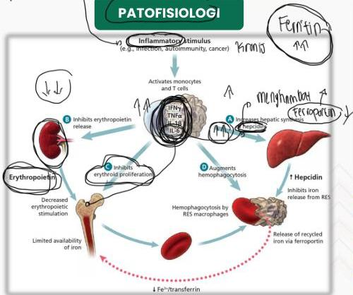

ANEMIA PENYAKIT KRONIS

PENYAKIT KRONIS

# ETIOLOGI

Ditemukan pada pasien yang penyakitnya memicu respons imun/inflamasi

- Infeksi kronik: TB, endokarditis, osteomyelitis kronik, HIV/AIDS, infeksi jamur sistemik
- Penyakit inflamasi dan autoimun: rheumatoid arthritis, demam rematik, SLE, vasculitis, IBD
- Keganasan: terutama keganasan darah seperti leukemia, limfoma maligna, multiple myeloma
- Penyakit kronis: CKD, CHF, COPD, obesitas, DM
- Anemia pada lansia
- Pasca transplantasi organ

Kelon Complete Batch Nov 2025

MEDIKO.ID

(PAPDI, 2019) Hal. 470 (Madu, 2015) Hal. 2