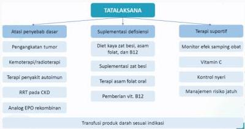

#

RATIONALE

Keluhan lemas dan lesu sejak 2 bulan, riwayat hemodialisa rutin + konjungtiva pucat, tidak ada pembesaran limpa (menyingkirkan anemia hemolitik) + Hb 8,3 g/dl → Dx. ANEMIA ec PENYAKIT KRONIS (CKD)

A. Pemberian tablet tambah darah (sebagai terapi suplementasi)
B. Pemberian eritropoetin
C. Pemberian zat besi (sebagai terapi suplementasi)
D. Pemberian asam folat (sebagai terapi suplementasi)
E. Pemberian steroid (tidak tepat)

Kelon Complete Batch Nov 2025

MEDIKO.ID

Referensi : Soal AIPKI Batch IV 2020