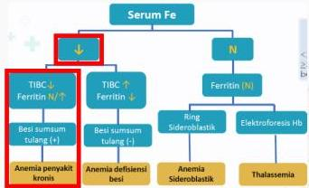

#

RATIONALE

Wanita 52 tahun penderita hipertensi dan diabetes dan tidak rutin berobat sejak 5 tahun, mengeluh sangat lemas dan tidak dapat beraktifitas + Pemfis konjungtiva anemis +/+, Hb 7.2 g/dl, MCV 85 (Normositik), eGFR 25 (CKD gr IV) → mengarahkan ke ANEMIA ec PENYAKIT KRONIS (CKD)

A. Menurun, menurun, menurun, menurun (ferritin meningkat)
B. Menurun, menurun, normal, normal (saturasi transferrin menurun dan ferritin meningkat)
C. Menurun, menurun, menurun, meningkat
D. Normal, normal, menurun, menurun (serum iron dan transferrin menurun, ferritin meningkat)
E. Normal, menurun, normal, menurun (serum iron menurun, saturasi transferrin menurun dan ferritin meningkat)

Kelon Complete Batch Nov 2025

MEDIKO.ID

ASSOCIATION FOR MEDICINE