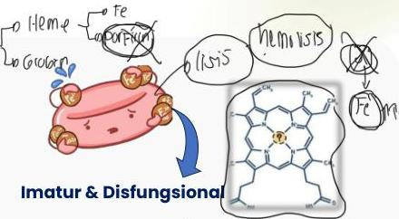

ANEMIA SIDEROBLASTIK

H

# DEFINISI

- Anemia akibat kegagalan sintesis heme yang terkait kelainan jalur porfirin sehingga terjadi defek eritropoiesis
- Akumulasi ring sideroblast → eritoblas berinti dengan granul besi patologis di matriks mitokondria

# ETIOLOGI

Kongenital: paling sering akibat mutasi genetik (ALAS2) (enzim pertama pada biosintesis heme) → X-linked

Didapat:

- Myelodysplasia syndrome
- Obat-obatan: isoniazid, Chloramphenicol
- Defisiensi/toksisitas: defisiensi Cu, overload Zn
- Metabolik: alkoholisme, malnutrisi (defisiensi B6)

# K

# X

# KUNIS

- Kongenital umumnya terdiagnosis saat anak-anak, didapat terdiagnosis saat dewasa
- Gejala umum anemia
- Hepato/splenomegali, fungsi hepar normal
- Iron overload: hiperpigmentasi kulit

Kelon Complete Batch Nov 2025

MEDIKO.ID

(Henry, 2022) Hal. 602 (Abu-Zeinah, 2020) Hal. 305