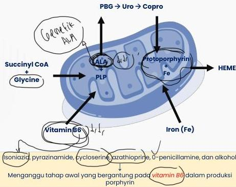

ANEMIA SIDEROBLASTIK

# PATOFISIOLOGI

# Jalur sintesis normal HEME

1. Glisin + suksinil-KoA → asam 8-aminolevulinat (8-ALA), dikatalisis oleh ALA sintase. Dibantu **koenzim piridoksal 5-fosfat (vitamin B6)**
2. Pembentukan porfobilinogen, uroporphyrinogen III, dan coproporphyrinogen III di sitoplasma sel.
3. **Tahap akhir** → produksi protoporfirin, pembentukan protoporphyrin IX (free erythrocyte protoporphyrin), dan besi → **heme**

# NOTE

- **Protoporphyrin IX** → penetrasi RBC &amp; melepaskan O2
- Kelasi besi - protoporphyrin IX ditentukan adekuatnya suplai Fe
- Defisiensi Fe → akumulasi protoporphyrin berlebih di RBC → lisis sel → **anemia hemolitik**

Kelon Complete Batch Nov 2025

MEDIKO.ID

(Abu-Zeinah, 2020) Hal. 307