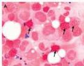
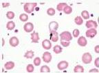
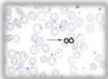

ANEMIA SIDEROBLASTIK

1 x awq1

# PENUNJANG

- DL: Hb (stabil pada kongenital, progresif pada MDS), WBC dan leukosit normal (rendah/tinggi pada MDS)
- MCV: mikrositik (kongenital) atau makrositik (MDS)
- Retikulosit normal atau meningkat
- BMP (Prussian Blue staining) → Ring sideroblast
- MDT → Basophilic stippling, Pappenheimer body

# TATALAKSANA

- Terapi penyebab dasar
- MDS: erythropoiesis-stimulating agents (ESA)
- Trial of pyridoxine:
- B6 (piridoksin) + asam folat dan thiamin (B1) sebagai suportif
- Transfusi PRC pada anemia berat/simtomatik dan disertai terapi dengan agen kelasi besi

# MEDIKOLOGIC

ASik PRB (Ingat aja Buku Biru PRB)
Anemia SideroblastiK Pappenheimer’s Body, Ring Sideroblastic, Basophilic Stippling

Ring sideroblastic

Basophilic Stippling

Pappenheimer’s body

Kelon Complete Batch Nov 2025

MEDIKO.ID

(Abu-Zeinah, 2020) Hal. 312