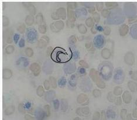

#

# Soal 6

Seorang pria berusia 35 tahun datang dengan keluhan mudah lelah dan lemas. Pada pemeriksaan tanda vital TD 115/80 mmHg, HR 82 x/menit, RR 19 x/menit, Temp 36.7°C. Pada pemeriksaan fisik didapatkan pasien tampak pucat dan konjungtiva anemis (+). Hasil pemeriksaan laboratorium menunjukkan Hb 7.5 g/dL, MCV 67 fL, MCH 20 pg, dan peningkatan serum iron. Kemudian dokter melakukan aspirasi sumsum tulang dan didapatkan hasil seperti gambar berikut.

## Apakah diagnosis yang tepat pada pasien ini?

A. Anemia aplastik
B. Anemia sideroblastik
C. Anemia megaloblastik
D. Sferositosis herediter
E. Anemia defisiensi besi

Kelon Complete Batch Nov 2025

MEDIKO.ID

ASSOCIATION OF MEDICINE