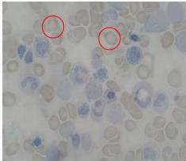

#

# RASIONALE

Pemeriksaan fisik konjungtiva anemis (+), Pemeriksaan lab Hb 7.5 g/dL, MCV 67 fL, MCH 20 pg (mikrositik hipokrom) dan peningkatan serum iron + aspirasi sumsum tulang didapatkan Papenheimer’s Body → Dx. ANEMIA SIDEROBLASTIK

A. Anemia aplastik (hiposeluler berisi lemak)
B. Anemia sideroblastik
C. Anemia megaloblastik (makrositik hipokromik)
D. Sferositosis herediter (tanda hemolisis, osmotic fragility test (+))
E. Anemia defisiensi besi (serum iron turun, TIBC naik)

Kelon Complete Batch Nov 2025

MEDIKO.ID

ASSOCIATION OF MEDICINE