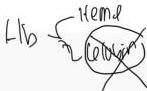
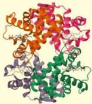
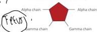
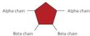
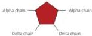
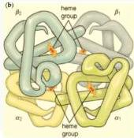
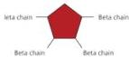
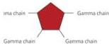

2

# THALASEMIA

# HEMOGLOBIN

- Merupakan **protein** tetramer yang terdiri dari empat subunit (dua rantai globin α dan dua non-α), masing-masing terdiri dari satu rantai polipeptida dan satu gugus heme dengan besi
- Produksi rantai globin α dan non-α menentukan komposisi dan jenis hemoglobin:
- **Adult Hb (HbA)**: 2 rantai α dan 2 rantai β (α2β2)
- **Fetal Hb (HbF)**: 2 rantai α dan 2 rantai γ (α2γ2)
- **HbA2**: 2 rantai α dan 2 rantai δ (α2δ2)
- Perkembangan Hb:
- **Saat lahir** → **HbF 80% dan HbA 20%** → HbA 20%
- Transisi dari sintesis globin gamma (HbF) ke sintesis globin beta (HbA) dimulai sebelum lahir
- Sekitar usia 6 bulan, bayi sehat akan bertransisi ke sebagian besar HbA, sedikit HbA2, dan HbF yang dapat diabaikan

Hemoglobin F (alpha, gamma,)

Hemoglobin A (alpha, beta,)

Hemoglobin A2 (alpha, delta,)

Hemoglobin H (beta,)

Hemoglobin Bart's (gamma,)

Kelon Complete Batch Nov 2025

MEDIKO.ID

(AAFP, 2009) Hal. 340