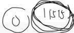
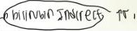
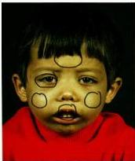
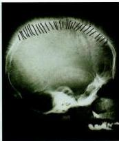

2

# THALASEMIA

H6 = 9106in

## DEFINISI

- Merupakan **defek sintesis rantai globin** polipeptida (α atau β) yang membentuk molekul Hb normal (Hb A, tetramer α₂/β₂).

## KLASIFIKASI

- **Secara fenotip:**
- **Mayor**: transfusion dependent
- **Intermedia**: gejala klinis ringan
- **Minor atau trait**: asimptomatik

- **Secara fenotip:**
- **Alfa**: defek gen α di kromosom 16
- **Beta**: defek gen β di kromosom 11 (lebih berat)

## KLINIS

- **Riwayat keluarga (+), riwayat transfusi berulang (+)**
- **Tanda hemolisis** (anemia kronik, jaundice, splenomegali usia dini)
- **Deformitas tulang → akibat kompensasi peningkatan eritropolesis**
- **Gangguan tumbuh kembang, gizi kurang, pubertas lambat,**
- **Hiperpigmentasi kulit perawakan pendek, mudah infeksi**

11515 = 0 (Fe + H)

## Beta thalassemia mayor

**Facies cooley**

**Hair on end**

## MEDIKOLOGIC

**4T**

**From Home**

Thalassemia
Transfusi berulang
Target cell
Teardrop cell

**Facies cooley**
Hair on end
Howell Jolly

Kelon Complete Batch Nov 2025

MEDIKO.ID

(PHTDL 2021) Hal. 1-3

(PNPK, 2018) Hal. 4,17