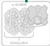
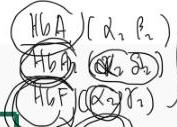
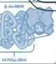
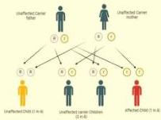

THALASEMIA

# Thalassemia

# Pola herediter thalassemia:
diturunkan secara autosomal resesif

# Penurunan sintesis Hb normal
(HbA), terdapat 3 tipe:

- **Mino**
- **Defek 1 rantai**
- Asimtomatik, perubahan indeks RBS

- **Intermediate**
- **Defek 2 rantai, lebih ringan**
- Gejala anemia (+), transfusi sesekali

- **Mayor**
- Produksi β globin tidak ada
- Diagnosis saat anak, anemia berat, fatigue kronis
- Transfusi jangka panjang

# MEDIKOLOGIG

A SIX (teen) BerSEBELAS
Alfa : Kromosom 16
Beta : Kromosom 11

# Pelon Complete Batch Nov 2025

# Thalassemia

# Terdiri dari 2 gen
4 lokus Gen

# Produksi Hb lebih rendah,
terdapat 4 tipe:

- **Silent-carrier**
- 1 delesi gen, 3 gen d normal
- Tidak ada abnormalitas

# Minor
- 2 delesi gen, 2 normal
- Asimtomatik, anemia ringan

# HbH disease
(β4)
- 3 delesi gen, d normal
- Anemia berat, icterus, splenomegali
- Dependen transfuse, hindari obat oksidatif

# Hb Bart's (γ4)
- 4 delesi gen
- Hydrops fetalis
- Fetal death

*edema anasarka*

MEDIKO.ID
ASSOCIATION OF THE ASSOCIATED
(Sadia, 2024) Hal. 82
(Meri, 2022) Hal. 27