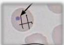

2

# THALASEMIA

## Apusan Darah Tepi

- Anisositosis dan poikilositosis: fragmentosit dan tear-drop, mikrositik hipokrom, sel target, Howell Jolly body, eritrosit berinti (defek eritropoiesis)
- Total hitung dan neutrofil meningkat
- Hipersplenisme → leukopenia, neutropenia, dan trombositopenia

Target Cell

Tear Drop Cell

Howell Jolly

## Red Cell Distribution Width (RDW)

- Thalasemia minor → sedikit peningkatan RDW
- Thalasemia mayor dan intermedia → peningkatan RDW tinggi

## Hb Elektroforesis

Gold standard diagnosis

- Thalassemia α: HbA1 ↓/HbA2 ↑, HbF ↓/HbH ↑, Hb Barts ↑
- Thalassemia β: HbA1 ↑, HbA2 ↑ &amp; HbF ↑

### Thalassemia α

|  Phenotype | Hb A | Hb Barts | Hb H  |
| --- | --- | --- | --- |
|  Normal | 97-98% | 0 | 0  |
|  Silent Carrier | 96-98% | 0-2 % (saat lahir) | 0  |
|  Thalassemia α | 85-95% | 2-8% (saat lahir) | <2%  |
|  HbH disease | Dec | <10% (saat lahir | 5-40%  |
|  Hydrops Fetalis | 0 | 70-80% (dengan 20% Hb Portland) | 0-20%  |

### Thalassemia β

|  Hemoglobin | Major | Minor | Normal  |
| --- | --- | --- | --- |
|  Hb F | 10-98% | Bervariasi | <1%  |
|  Hb A | 0 | 80-90% | 97%  |
|  Hb A2 | Bervariasi | 5-10% (meningkat) | 1-3%  |

Kelon Complete Batch Nov 2025

MEDIKO.ID

(PNPK, 2018) Hal. 17-21