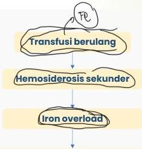

2

THALASEMIA = Hemorris = Fe ↑↑

# TATALAKSANA: Transfusi PRC

- Tujuan transfusi → menekan hematopoiesis ekstramedular dan mengoptimalkan tumbuh kembang anak
- Kondisi lebih berat, transfusi lebih sering → tiap 3-4 minggu

## Indikasi:

- Pemeriksaan menunjukkan thalassemia mayor
- Hb &lt; 7 gr/dL tanpa tanda infeksi
- Hb &gt; 7 gr/dL, apabila terdapat gagal tumbuh dan deformitas tulang akibat thalassemia
- Volume darah yang ditransfusi tergantung nilai Hb, diberikan sampai target Hb 12

Komplikasi: "HEMOKROMATOSIS"
- Pituitasi: gangguan pertumbuhan
- Jantung: kardiomiopati, gagal jantung
- Liver: sirosis hepatitis
- Pankreas: diabetes melitus
- Paratiroid: osteoporosis
- Kulit: hiperpigmentasi
- Gonads: hipogonadism, infertilitas

Keterlibatan jantung merupakan penyebab terbanyak kematian pada talasemia

Kelon Complete Batch Nov 2025

MEDIKO.ID

(PNPK, 2018) Hal. 32

(Meri, 2022) Hal. 30