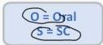
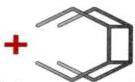
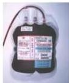

2

THALASEMIA

# TATALAKSANA Iron Overload

Tujuan: mengikat besi yang tidak terikat transferrin di plasma dan mengeluarkannya dari tubuh

## INDIKASI:
- Ferritin ≥ 1000 ng/dl
- Saturasi transferrin ≥ 70%
- Transfusi &gt; 3-5 liter
- Transfusi &gt; 10-20 x

Agen kelasi besi
- Deferipron
- Deferasirox
- Deferoksamin → lini pertama pada anak &gt;2 tahun

# IRON CHELATING AGENT

Metallic ion

Chelating agent

Metallic chelate

TRANSFUSI PRC BERKALA

IRON CHELATING

Kelon Complete Batch Nov 2025

MEDIKO.ID

(PNPK, 2018) Hal. 32-36