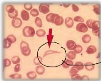
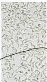
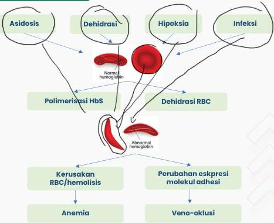

SICKLE CELL ANEMIA

HbS

Resisten

Malaria

# DEFINISI

- **Mutasi gen** yang mengkode subunit beta globin menyebabkan pembentukan HbS
- HbS yang terdeoksigenasi bersifat kurang larut dibandingkan HbA normal → mengalami polimerisasi yang menghasilkan sel darah merah sabit yang khas

Sickled erythrocyte

# PATOFISIOLOGI

Kelon Complete Batch Nov 2025

MEDIKO.ID

(Inati, 2008) Hal. 311