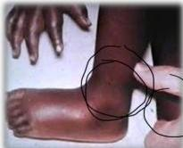
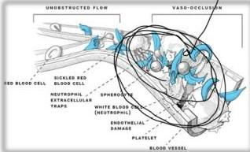

SICKLE CELL ANEMIA

lonyk

# KLINIS

## Hemolisis:
Anemia, ikterik, batu empedu, hipertensi pulmonal, kardiomegali, ulkus, gagal tumbuh

## Veno oklusi:
Nyeri berulang, stroke, nyeri dada akut, edema dan inflamasi sendi, peningkatan infeksi, kegagalan organ, hand-foot syndrome atau aseptic dactylitis

## Hand-foot syndrome
bisa menjadi
manifestasi awal →
disebabkan infark
sumsum tulang dan
tulang kortikal
ekstremitas

# TATALAKSANA

- Terapi: **Hydroxyurea** → untuk mengurangi gejala dan veno-occlusive crisis
- Transfusi dan kelasi besi pada anemia berat
- Manajemen nyeri

veno-occlusive crisis

Kelon Complete Batch Nov 2025

MEDIKO.ID

(Inati, 2008) Hal. 317

(Inusa, 2019) Hal. 2