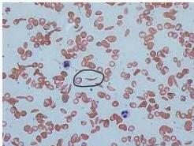

#

# Soal 9

Seorang Pria 18 tahun datang ke poliklinik dengan keluhan mudah mengantuk sejak 1 bulan yang lalu. Keluhan makin lama makin memberat. Pasien diketahui sering mengalami nyeri sendi berulang sejak kecil. Pada pemeriksaan fisik pasien tampak kurus, konjungtiva anemis (+), sklera ikterik (+), lien teraba schuffner 3. Dari pemeriksaan laboratorium didapatkan hasil Hb 8.5 g/dL, MCV 85 fL, MCH 32 pg, dan peningkatan bilirubin indirek. Hasil pemeriksaan apusan darah tepi didapatkan gambar sebagai berikut.

Hemwus

## Apakah kemungkinan diagnosis pada pasien tersebut?

A. Anemia pernisiosa
B. Sferositosis herediter
C. AIHA
D. Sickle cell anemia
E. Anemia defisiensi G6PD

Kelon Complete Batch Nov 2025

MEDIKO.ID

ASSOCIATE MEDICINOLOGY