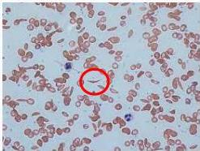

#

# RASIONALE

Keluhan mudah mengantuk, sering mengalami nyeri sendi berulang sejak kecil + konjungtiva anemis (+), sklera ikterik (+), lien teraba schuffner 3 + Hb 8.5 g/dL, MCV 85 fL, MCH 32 pg (normositik normokromik) dan peningkatan bilirubin indirek + ADT ditemukan Sel seperti Bulan Sabit → Dx. SICKLE CELL ANEMIA

A. Anemia pernisiosa (MCV &gt; 100 fL, uji schilling (+))
B. Sferositosis herediter (osmotic fragility test (+))
C. AIHA (coomb test (+))
D. Sickle cell anemia
E. Anemia defisiensi G6PD (heinz bodies dan bite cell)

Kelon Complete Batch Nov 2025

MEDIKO.ID

ASSOCIATION OF MEDICINE