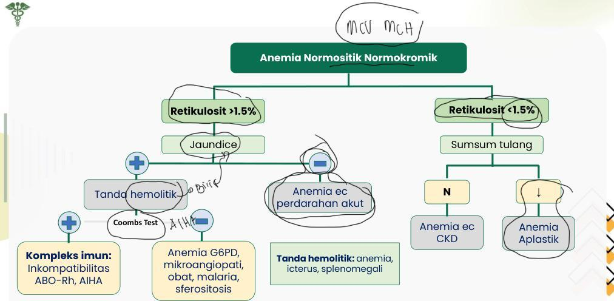

KELON COMPLETE BATCH NOV 2025

MEDIKO.ID

(PAPDI, 2014) Hal, 2580

3A

2

Anemia Normositik Normokromik

Metikulosit &gt;1.5%

Jaundice

Tanda hemolitik

Coombs Test

A1HA

Anemia ec perdarahan akut

Anemia G6PD, mikroangiopati, obat, malaria, sferositosis

Tanda hemolitik: anemia, icterus, splenomegali

Retikulosit &lt;1.5%

Sumsum tulang

N

Anemia ec CKD

Anemia Aplastik