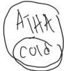
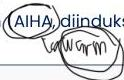
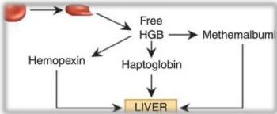
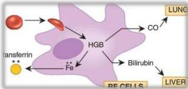

ANEMIA HEMOLITIK

151s RBC

Hej, hej, hej, hej, hej, hej, hej, hej, hej, hej, hej, hej, hej

# Intravaskular

Infeksi: malaria, babesiosis, C. perfringens
Dimediasi komplemen: (PNH) diinduksi obat/toksin, ABO mismatch

Mekanik:
- Katup prostetik
- Mikroangiopati: ITP, DIC, HUS, preeklampsia

# Ekstravaskular

Kelainan intrinsik RBC:
- Hemoglobinopati (sickle cell disease, thalassemia)
- Enzimopati (defisiensi G6PD)
- Defek membran (sferositosis herediter)

Kelainan ekstrinsik RBC:
Hemolitik dimediasi imun (AIHA diinduksi obat)

Intravaskular

Ekstravaskular

Kelon Complete Batch Nov 2025

MEDIKO.ID

(PAPDI, 2019) Hal. 461-462

3A