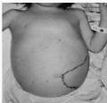
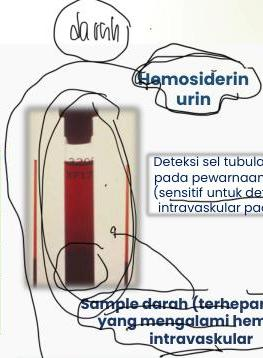
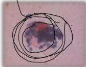

ANEMIA HEMOLITIK

PATOFISIOLOGI

|  Intravaskular | Ekstravaskular  |
| --- | --- |
|  • Mekanisme minor | • Mekanisme mayor  |
|  • Kompleks Hb-haptoglobin | • Dimediasi makrofag  |
|  • Di dalam pembuluh darah | • Spleen, hepar, sumsum tulang  |
|  • Anemia, ikterik, hemoglobinemia, hemoglobinuria, hemosiderinuria, penurunan haptoglobin | • Anemia, ikterik, splenomegaly, peningkatan bilirubin (indirek >>) → prehepatal  |

Konjungtiva Anemis

Sklera Ikterik

Hepatosplenomegali

Hemosiderin
urin

Deteksi sel tubular yang terlihat pada pewarnaan Prussian blue (sensitif untuk deteksi hemolisis intravaskular pada fase awal)

Sample darah (terheparinisasi) yang mengalami hemolitik intravaskular

Hemolisis intravaskular pada sejumlah RBC → memberikan warna merah muda hingga merah tua pada plasma

Kelon Complete Batch Nov 2025

MEDIKO.ID

(PAPDI, 2019) Hal. 461-462

3A