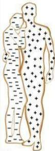
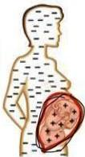
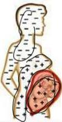
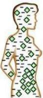
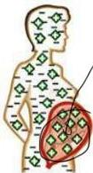
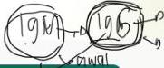

2

# INKOMPATIBILITAS RHEUS

Antigen
Antibodi

# PATOFISIOLOGI

Ibu RhD - Ayah RhD +

Kehamilan pertama: janin RDH +

Antigen RhD+ janin masuk ke sirkulasi darah ibu

Ibu menjadi tersensitisasi membentuk antibodi anti-D IgG

Kehamilan selanjutnya: antibodi ibu menyerang antigen RhD+ RBC janin

Konsekuensi hemolytic disease of the fetus and newborn: anemia, hydrops fetalis, IUFD

1987 1967 (1987) (1987) (1987) (1987) (1987) (1987)

# TATALAKSANA

- Tekst lembur lawar darah pcesen

# Profilaksis immunoglobulin anti-D IgG 300 μg IM atau IV: (Phe long)

- Secara rutin tiap usia 28 minggu jika diagnosis inkompatibilitas Rh didapatkan saat hamil
- Postpartum: 72 jam setelah melahirkan anak pertama jika bayi pertama Rh+. Jika terlambat, pemberian dapat dilakukan sampai dengan 28 hari postpartum

# Pada bayi:

- Fototerapi (terapi awal)
- Exchange transfusion

Kelon Complete Batch Nov 2025

MEDIKO.ID

(Sungkar, 2020) Hal. 1-4