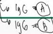
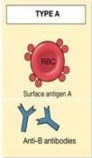
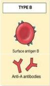
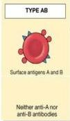
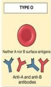
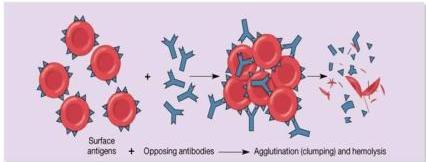

INKOMPATIBILITAS ABO

Ringan

Foloterapi

# DEFINISI

- Destruksi RBC fetal atau neonatal oleh Ig-G ibu
- Dialami oleh ibu golongan darah O dengan bayi bergolongan darah A atau B

# ETIOLOGI

- Golongan darah A dan B memiliki anti-A dan anti-B yang merupakan IgM (tidak melewati sawar darah plasenta)
- Golongan darah O memiliki antibodi IgG (dapat melewati sawar darah plasenta)
- Transfer antibodi IgG ke sirkulasi janin menyebabkan hemolisis

# KLINIS

- Umumnya bersifat ringan (hyperbilirubinemia &lt;24 jam) dan membaik dengan fototerapi
- Ikterik berat/kernikterus: exchange transfusion

(a)

(b)

Kelon Complete Batch Nov 2025

MEDIKO.ID

(Nagashree, 2019) Hal. 766-768