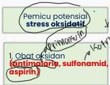
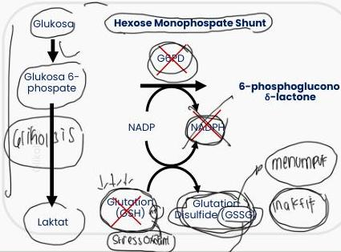
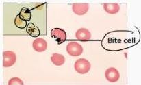

ANEMIA DEFISIENSI G6PD

defisioner

# Etiologi: diturunkan secara (inked resesi)

G6PD → enzim penting pada glikolisis untuk mempertahankan penyimpanan adekuat dari reduced glutation untuk melindungi RBC dari kerusakan oksidatif

# PENUNJANG

Hb precipitat membentuk badan inklusi terikat RBC

Heinz bodies tampak dengan supravital stain

Makrofag di limpa menyingkirkan Heinz body dari membran RBC

Bite cells → RBC terpotong berbentuk semisirkuler

# TATALAKSANA

Atasi infeksi dan menghentikan obat-obatan penyebab

Kelon Complete Batch Nov 2025

MEDIKO.ID

(Luzzatto, 2020) Hal. 1225

(PAPDI, 2019) Hal. 462

3A