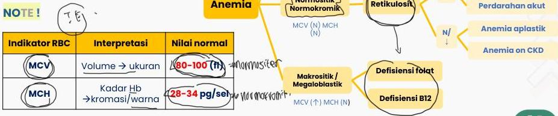

ANEMIA

$D_{HC} \downarrow \downarrow (1)$

$H_{1} \cap S = D \cap (1,2) \Rightarrow (1,3) = D$

# DEFINISI

Penurunan jumlah massa eritrosit sehingga tidak dapat membawa oksigen yang adekuat ke jaringan perifer

|  Kondisi | Hb Anemia  |
| --- | --- |
|  Laki-laki (>15 tahun) | <13 gr/dL  |
|  Perempuan tidak hamil | <12 gr/dL  |
|  Perempuan hamil | <11 g/dL  |

# KLASIFIKASI

## Mikrositik Hipokromik
MCV (J) MCH (J)

## Besi serum

## Thalasemia

## Sideroblastik

## Sickle cell anemia

## Defisiensi Fe

## Penyakit kronik

## Anemia hemolitik

## Perdarahan akut

## Anemia aplastik

## Anemia on CKD

# NOTE!

Kelon Complete Batch Nov 2025

MEDIKO.ID

(PAPDI, 2014) Hal. 2575

(WHO, 2011) Hal. 3

4A

3A